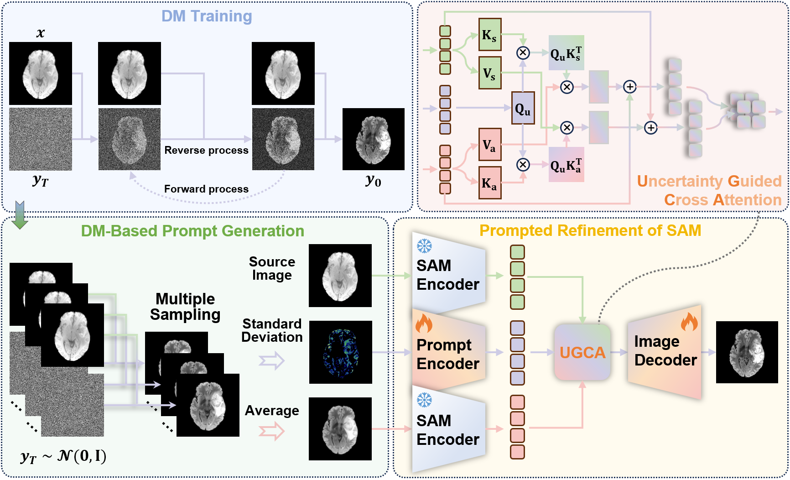

# Cascaded Diffusion Model and Segment Anything Model for Medical Image Synthesis via Uncertainty-Guided Prompt Generation

# 🚧 Repository Update in Progress 🚧  

## 1. Overview
</img>

Fig.1: An overview of our method. Our method cascades the DM with SAM, where the uncertainty of DM output serves as the prompt for SAM. The UGCA module allows interaction between the prompt, source image, and DM output for the final synthesis.

## 2. Data Preprocessing
We evaluated our method on two public datasets containing data from patients with structural abnormalities: [BraSyn](https://www.synapse.org/Synapse:syn53708249/wiki/627507) and [SynthRAD](https://synthrad2023.grand-challenge.org/).
The BraSyn dataset includes brain MRI scans of 1,470 patients, comprising aligned T1w, T2w, FLAIR, and T1CE images.
We used the T1w and FLAIR images for the T1-to-FLAIR synthesis task.
The SynthRAD dataset includes brain images of 180 patients, comprising aligned MRI and CT scans.
We used the MRI and CT scans for the MRI-to-CT synthesis task. 

All images are normalized by clipping the intensity values to the range between the 0.5th and 99.5th percentiles, followed by rescaling to the range of [0,1].
To meet the input requirements of SAM, 3D images are split into 2D slices and resized to 512 $\times$ 512, and the channels are repeated three times for input consistency.

```
cd DM-SAM/preprocess
python normalization.py
python split.py
```

## 3. Usage

```
cd DM-SAM
python DM_train.py
python DM_repeated_sampling.py
python SAM_train.py
python DM_SAM_test.py
```
