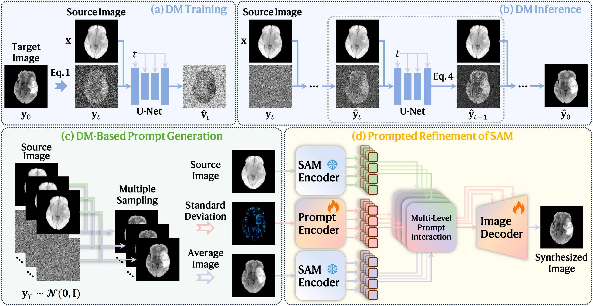

# DM-SAM: Cascaded Diffusion Model and Segment Anything Model for Medical Image Synthesis

> Official PyTorch implementation of the paper  
> **"Cascaded Diffusion Model and Segment Anything Model for Medical Image Synthesis via Uncertainty-Guided Prompt Generation"**  
> (*IPMI 2025*)

---
## 🚧 Repository Update in Progress 🚧  

## 🚀 Overview

**DM-SAM** is a novel framework that integrates the **Diffusion Model (DM)** and the **Segment Anything Model (SAM)** for medical image synthesis.  
The key idea is to leverage the **uncertainty** of diffusion model outputs as **prompts** to guide SAM-based image synthesis refinement.

  
*Figure: Overview of the proposed DM-SAM framework.*

---

## 🧰 Installation

### 1️⃣ Create and activate the environment
```bash
conda create -n dmsam python=3.10 -y
conda activate dmsam
````

### 2️⃣ Install dependencies

```bash
pip install -r requirements.txt
```

---

## 📊 Datasets

Experiments in this paper were conducted on three publicly available datasets:

- **[BraSyn 2023](https://www.synapse.org/Synapse:syn53708249/wiki/627507)** — 1,470 MRI scans of brain tumor patients for multi-contrast MRI synthesis.  
- **[SynthRAD 2023](https://synthrad2023.grand-challenge.org)** — 120 paired T1CE–CT brain scans for MRI-to-CT synthesis.  
- **[SynthRAD 2025](https://synthrad2025.grand-challenge.org)** — 258 paired CBCT–CT scans for thoracic cancer radiotherapy planning.  

---

## 💻 Usage

### 1️⃣ Data preprocessing

```bash
python preprocess/BraSyn.py
```

### 2️⃣ Training the Diffusion Model

```bash
python DM_train.py
```

### 3️⃣ Inference with the Diffusion Model (to obtain mean image and uncertainty map)

```bash
python DM_inference.py
```

### 4️⃣ Training the SAM-based synthesis model

```bash
python SAM_train.py
```

### 5️⃣ Testing / Evaluation

```bash
python SAM_test.py
```

---

## 🔍 Citation

If you find this repository useful, please cite:

```bibtex
@inproceedings{pang2025cascaded,
  title={Cascaded Diffusion Model and Segment Anything Model for Medical Image Synthesis via Uncertainty-Guided Prompt Generation},
  author={Pang, Haowen and Hong, Xiaoming and Zhang, Peng and Ye, Chuyang},
  booktitle={International Conference on Information Processing in Medical Imaging},
  pages={203--217},
  year={2025},
  organization={Springer}
}
```